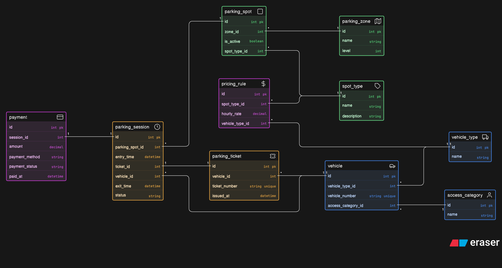

# Comic-Con Parking System — ER Diagram

## Overview

This project contains the Entity-Relationship (ER) diagram for a multi-zone parking system designed for a large convention event such as Comic-Con.
The system manages vehicle entry and exit, parking spot allocation, ticket generation, pricing rules, and payment tracking across different parking zones and categories.

The design supports multiple vehicle types, reserved access categories, and reusable parking spots over multiple days.

---

## ER Diagram

Db design:



---

## Main Entities

- Vehicle
- Vehicle Type
- Access Category
- Parking Zone
- Parking Spot
- Spot Type
- Pricing Rule
- Parking Ticket
- Parking Session
- Payment

---

## Key Relationships

- One **vehicle** belongs to one **vehicle type**
- One **vehicle** belongs to one **access category**
- One **parking zone** contains many **parking spots**
- One **spot type** can be used by many **parking spots**
- One **vehicle** can have multiple **parking sessions**
- One **parking spot** can be reused across many sessions
- One **parking ticket** is issued for each parking session
- One **parking session** can have one or more **payments**
- Parking charges are calculated based on **vehicle type** and **spot type**

---

## Project Structure

```
comic-con-parking-system/
│
├── ER.txt
├── ER-Diagram.png
└── README.md
```
